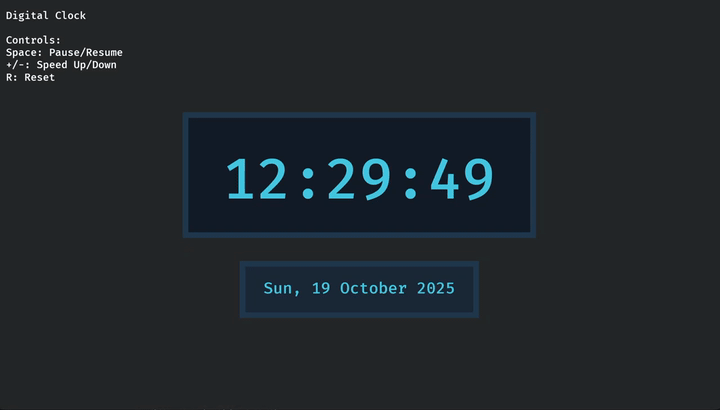

# Bevy In-Game Clock

A plugin for the [Bevy game engine](https://bevyengine.org) that provides an in-game clock system with date/time tracking, configurable speed, sending events on time based intervals, and flexible formatting.

## Features

- 📅 **Date & Time Tracking** - Full date and time support with configurable start date/time
- ⏰ **Flexible Speed Control** - Set speed by multiplier or by real-time duration per in-game day
- ⚡ **Adjustable Clock Speed** - Slow motion, fast forward, or any custom speed
- ⏸️ **Pause and Resume** - Full control over clock state
- 🎨 **Flexible Formatting** - Default or custom datetime formats using chrono
- 📆 **Date Calculations** - Automatic handling of months, years, and leap years via chrono
- ⚙️ **Event System** - Receive Bevy events at configurable intervals (hourly, daily, custom)
- 🗓️ **Custom Calendars** - Support for non-Gregorian calendars (fantasy worlds, sci-fi settings)
- 🎮 **Simple Integration** - Easy to use with Bevy's ECS

## Compatibility

| Bevy Version | Plugin Version |
|--------------|----------------|
| 0.17         | 0.2            |

## Installation

Add this to your `Cargo.toml`:

```toml
[dependencies]
bevy = "0.17"
bevy_ingame_clock = "0.2"
```

## Quick Start

```rust
use bevy::prelude::*;
use bevy_ingame_clock::{InGameClockPlugin, InGameClock};

fn main() {
    App::new()
        .add_plugins(DefaultPlugins)
        .add_plugins(InGameClockPlugin)
        .add_systems(Update, display_time)
        .run();
}

fn display_time(clock: Res<InGameClock>) {
    println!("In-game datetime: {}", clock.format_datetime(None));
}
```

## Usage Examples

### Setting Start Date/Time

```rust
use bevy_ingame_clock::InGameClock;

fn setup(mut commands: Commands) {
    // Default: uses current UTC date/time
    commands.insert_resource(InGameClock::new());
    
    // Custom start date/time: June 15, 2024 at 8:00:00 AM
    commands.insert_resource(
        InGameClock::with_start_datetime(2024, 6, 15, 8, 0, 0)
    );
}
```

### Adjusting Clock Speed

```rust
fn setup_speed(mut clock: ResMut<InGameClock>) {
    // Method 1: Direct speed multiplier
    clock.set_speed(2.0);  // Time passes 2x faster
    
    // Method 2: Set by day duration (more intuitive for game design)
    // One in-game day passes every 60 real seconds (1 minute)
    clock.set_day_duration(60.0);
    
    // One in-game day passes every 1200 real seconds (20 minutes)
    clock.set_day_duration(1200.0);
    
    // Get current day duration
    let duration = clock.day_duration();
    println!("One day takes {} real seconds", duration);
}
```

### Builder Pattern Configuration

```rust
fn setup(mut commands: Commands) {
    commands.insert_resource(
        InGameClock::with_start_datetime(2024, 6, 15, 8, 0, 0)
            .with_speed(10.0)  // Or use .with_day_duration(120.0)
    );
}
```

### Pausing the Clock

```rust
fn toggle_pause_system(
    mut clock: ResMut<InGameClock>,
    keyboard: Res<ButtonInput<KeyCode>>,
) {
    if keyboard.just_pressed(KeyCode::Space) {
        clock.toggle_pause();
    }
}
```

### Reading Date and Time

```rust
fn check_datetime(clock: Res<InGameClock>) {
    // Get formatted strings (default formats)
    let datetime = clock.format_datetime(None);  // "2024-06-15 14:30:45"
    let date = clock.format_date(None);          // "2024-06-15"
    let time = clock.format_time(None);          // "14:30:45"
    
    // Get individual components
    let (year, month, day) = clock.current_date();
    let (hour, minute, second) = clock.current_time();
    println!("{}-{:02}-{:02} {:02}:{:02}:{:02}", year, month, day, hour, minute, second);
    
    // Get as chrono NaiveDateTime for advanced operations
    let dt = clock.current_datetime();
    println!("Day of week: {}", dt.weekday());
}
```

### Custom Formatting

```rust
fn custom_formats(clock: Res<InGameClock>) {
    // Custom date formats
    clock.format_date(Some("%d/%m/%Y"));          // "15/06/2024"
    clock.format_date(Some("%B %d, %Y"));         // "June 15, 2024"
    clock.format_date(Some("%A, %B %d, %Y"));     // "Saturday, June 15, 2024"
    
    // Custom time formats
    clock.format_time(Some("%I:%M %p"));          // "02:30 PM"
    clock.format_time(Some("%H:%M"));             // "14:30"
    
    // Custom datetime formats
    clock.format_datetime(Some("%d/%m/%Y %H:%M")); // "15/06/2024 14:30"
    clock.format_datetime(Some("%B %d, %Y at %I:%M %p")); // "June 15, 2024 at 02:30 PM"
    clock.format_datetime(Some("%c"));             // Locale-specific format
}
```

**Format Specifiers** (via chrono):
- `%Y` - Year (4 digits)
- `%m` - Month (01-12)
- `%d` - Day (01-31)
- `%H` - Hour 24h (00-23)
- `%I` - Hour 12h (01-12)
- `%M` - Minute (00-59)
- `%S` - Second (00-59)
- `%p` - AM/PM
- `%B` - Full month name
- `%A` - Full weekday name
- `%E` - Epoch name (for custom calendars only)
- See [chrono format docs](https://docs.rs/chrono/latest/chrono/format/strftime/index.html) for more

### Interval Events

The event system allows you to receive Bevy messages at specific in-game time intervals.

```rust
use bevy_ingame_clock::{ClockCommands, ClockInterval, ClockIntervalEvent};

fn setup(mut commands: Commands) {
    // Register intervals to receive events
    commands.register_clock_interval(ClockInterval::Hour);
    commands.register_clock_interval(ClockInterval::Day);
    
    // Custom interval: every 90 seconds
    commands.register_clock_interval(ClockInterval::Custom(90));
    
    // Registering the same interval multiple times is safe - duplicates are automatically prevented
    commands.register_clock_interval(ClockInterval::Hour); // This is silently ignored
}

fn handle_events(mut events: MessageReader<ClockIntervalEvent>) {
    for event in events.read() {
        match event.interval {
            ClockInterval::Hour => println!("An hour passed! (count: {})", event.count),
            ClockInterval::Day => println!("A day passed! (count: {})", event.count),
            ClockInterval::Custom(seconds) => {
                println!("Custom interval of {} seconds passed!", seconds);
            },
            _ => {}
        }
    }
}
```

**How It Works:**
- Register intervals during setup or at any time during gameplay
- Events are triggered when the in-game time crosses interval boundaries
- Each event includes a `count` field tracking total occurrences since the clock started
- **Duplicate prevention:** Registering the same interval multiple times is safe - only one tracker is created
- **No unregistration:** Once registered, intervals cannot be removed. Filter events in handlers if needed.

**Available Intervals:**
- `ClockInterval::Second` - Every in-game second
- `ClockInterval::Minute` - Every 60 in-game seconds
- `ClockInterval::Hour` - Every hour (duration depends on calendar: 3600s for Gregorian, configurable for custom calendars)
- `ClockInterval::Day` - Every day (duration depends on calendar: 86400s for Gregorian, configurable for custom calendars)
- `ClockInterval::Week` - Every week (duration depends on calendar: 604800s for Gregorian, configurable for custom calendars)
- `ClockInterval::Custom(seconds)` - Custom interval in seconds

**Note:** When using custom calendars, the Hour, Day, and Week intervals automatically adjust to match the calendar's configured time units. For example, with a 20-hour day, the Day interval fires every 72000 seconds instead of 86400.

### Custom Calendars

The plugin supports custom calendar systems for fantasy or sci-fi games with non-Gregorian time structures.

#### Creating Custom Calendars: Two Approaches

You can create custom calendars in two ways:

**1. Builder Pattern (Programmatic)**

Create calendars directly in code using the `CustomCalendarBuilder`:

```rust
use bevy_ingame_clock::{CustomCalendarBuilder, Month, Epoch};

fn setup(mut commands: Commands) {
    let fantasy_calendar = CustomCalendarBuilder::new()
        .minutes_per_hour(60)
        .hours_per_day(20)
        .months(vec![
            Month::new("Frostmoon", 20, 3),
            Month::new("Thawmoon", 21, 0),
            Month::new("Bloomtide", 19, 2),
        ])
        .weekday_names(vec![
            "Moonday".to_string(),
            "Fireday".to_string(),
            "Waterday".to_string(),
            "Earthday".to_string(),
            "Starday".to_string(),
        ])
        .leap_years("# % 2 == 0")
        .epoch(Epoch::new("Age of Magic", 1000))
        .build();

    let clock = InGameClock::new()
        .with_calendar(fantasy_calendar)
        .with_day_duration(60.0);
    
    commands.insert_resource(clock);
}
```

**2. RON Configuration Files**

Load calendars from configuration files for easier editing by designers:

```rust
use bevy_ingame_clock::{CustomCalendar, InGameClock};
use std::fs;

fn setup(mut commands: Commands) {
    let calendar_config = fs::read_to_string("assets/fantasy_calendar.ron")
        .expect("Failed to read calendar file");
    
    let fantasy_calendar: CustomCalendar = ron::from_str(&calendar_config)
        .expect("Failed to parse calendar file");

    let clock = InGameClock::new()
        .with_calendar(fantasy_calendar)
        .with_day_duration(60.0);
    
    commands.insert_resource(clock);
}
```

Example RON file (`assets/fantasy_calendar.ron`):

```ron
(
    minutes_per_hour: 60,
    hours_per_day: 20,
    months: [
        (name: "Frostmoon", days: 20, leap_days: 3),
        (name: "Thawmoon", days: 21, leap_days: 0),
        (name: "Bloomtide", days: 19, leap_days: 2),
    ],
    weekday_names: ["Moonday", "Fireday", "Waterday", "Earthday", "Starday"],
    leap_years: "# % 2 == 0",
    epoch: (name: "Age of Magic", start_year: 1000),
)
```

**Which Approach to Use?**

- **Builder Pattern**: Best when calendars are defined in code and don't change
- **RON Files**: Best when you want designers to edit calendars without recompiling, or when you need multiple calendar variants

Both approaches create identical `CustomCalendar` instances and work seamlessly with the same API.

#### Configuration Options
- `minutes_per_hour`: Number of minutes in an hour
- `hours_per_day`: Number of hours in a day
- `leap_years`: Leap year expression - a boolean expression using `#` as the year placeholder (see Leap Year System below)
- `months`: Array of month definitions, each with:
  - `name`: Month name
  - `days`: Base number of days in the month
  - `leap_days`: Additional days added during leap years (allows distributing leap days across months)
- `weekday_names`: Names for each day of the week. The number of weekday names determines the days per week. The first name in the list is day 0 of the week
- `epoch`: Epoch definition with:
  - `name`: Name of the epoch (e.g., "Age of Magic", "Common Era")
  - `start_year`: Starting year for the calendar system

**Leap Year System:**

The leap year system uses boolean expressions to define when leap years occur. The `leap_years` field accepts a string expression using `#` as a placeholder for the year value.

**Expression Syntax:**

Expressions use the variable `year` and support:
- Arithmetic: `+`, `-`, `*`, `/`, `%` (modulo)
- Comparison: `==`, `!=`, `<`, `>`, `<=`, `>=`
- Logical: `&&` (and), `||` (or), `!` (not)
- Parentheses for grouping: `(`, `)`
- Use `#` as the year placeholder

**Examples:**

```ron
// RON file examples:
leap_years: "# % 4 == 0"                                    // Every 4 years
leap_years: "# % 2 == 0"                                    // Every 2 years
leap_years: "# % 4 == 0 && (# % 100 != 0 || # % 400 == 0)" // Gregorian rule
leap_years: "(# % 3 == 0 && # % 9 != 0) || # % 27 == 0"    // Complex custom rule
leap_years: "false"                                         // No leap years
```


**Leap Day Distribution:**

Each month can specify `leap_days` - extra days added during leap years. This allows you to distribute leap days across multiple months or concentrate them in specific months, unlike the Gregorian calendar which adds all leap days to one month.

**Total Year Length:**

In a normal year, the year length is the sum of all month `days`. In a leap year, it's the sum of all `(days + leap_days)`.

Example: In the fantasy calendar above with `leap_years: "# % 2 == 0"`:
- Normal years (1001, 1003, 1005...): 201 days total
- Leap years (1000, 1002, 1004...): 208 days total (7 extra leap days distributed: Frostmoon +3, Bloomtide +2, Icemoon +2)

For more examples, see the [`examples/custom_calendar.rs`](examples/custom_calendar.rs) file and [`examples/fantasy_calendar.ron`](examples/fantasy_calendar.ron) configuration.

## API Reference

### `InGameClockPlugin`

The main plugin. Add it to your Bevy app to enable clock functionality.

### `InGameClock` Resource

| Field | Type | Description |
|-------|------|-------------|
| `elapsed_seconds` | `f64` | Total in-game time elapsed in seconds since start |
| `speed` | `f32` | Speed multiplier (1.0 = real-time, 2.0 = double speed) |
| `paused` | `bool` | Whether the clock is paused |
| `start_datetime` | `NaiveDateTime` | The starting date/time for the clock |

### Methods

#### Construction & Configuration
- `new()` - Create a new clock with current UTC date/time
- `with_start_datetime(year, month, day, hour, minute, second)` - Set specific start date/time
- `with_start(datetime)` - Set start from a `NaiveDateTime`
- `with_speed(speed)` - Set initial speed multiplier
- `with_day_duration(real_seconds_per_day)` - Set speed by defining real seconds per in-game day

#### Control
- `pause()` - Pause the clock
- `resume()` - Resume the clock
- `toggle_pause()` - Toggle pause state
- `set_speed(speed)` - Change the clock speed multiplier
- `set_day_duration(real_seconds_per_day)` - Change speed by day duration
- `day_duration()` - Get current day duration in real seconds

#### Reading Time
- `current_datetime()` - Get current `NaiveDateTime` (use chrono traits for advanced operations)
- `current_date()` - Get current date as `(year, month, day)`
- `current_time()` - Get current time as `(hour, minute, second)`
- `as_hms()` - Get time as `(hours, minutes, seconds)` tuple

#### Formatting
- `format_datetime(format)` - Format date and time (default: "YYYY-MM-DD HH:MM:SS")
- `format_date(format)` - Format date only (default: "YYYY-MM-DD")
- `format_time(format)` - Format time only (default: "HH:MM:SS")

All formatting methods accept `Option<&str>` where `None` uses the default format, or `Some("format_string")` for custom chrono format strings.

### Events

#### `ClockIntervalEvent`

Message sent when a registered time interval has passed.

**Fields:**
- `interval: ClockInterval` - The interval that triggered the event
- `count: u64` - Total number of times this interval has passed

#### `ClockInterval` Enum

Defines time intervals for events:
- `Second`, `Minute`, `Hour`, `Day`, `Week` - Built-in intervals
- `Custom(u32)` - Custom interval in seconds

#### `ClockCommands` Trait

Extension trait for `Commands` to register intervals:
- `register_clock_interval(interval)` - Register an interval to receive events

## Examples

Run the basic example with interactive controls:

### Basic Example

```bash
cargo run --example basic
```

Interactive demo showing clock controls and display.

**Controls:**
- `Space` - Pause/Resume
- `+/-` - Double/Halve speed
- `1-6` - Set day duration (30s, 60s, 5min, 10min, 20min, real-time)
- `R` - Reset clock

### Events Example

```bash
cargo run --example events
```

Demonstrates the interval event system with multiple registered intervals.

**Controls:**
- `Space` - Pause/Resume
- `+/-` - Speed Up/Down
- `1-6` - Toggle different interval events ON/OFF
- `R` - Reset clock

### Digital Clock Example

```bash
cargo run --example digital_clock
```

Visual digital clock display, showing time in digital format with a date calendar display.



**Controls:**
- `Space` - Pause/Resume
- `+/-` - Speed Up/Down
- `R` - Reset clock

### Custom Calendar Example

```bash
cargo run --example custom_calendar
```

Demonstrates implementing and using a custom fantasy calendar system loaded from a RON file with:
- 60 minutes per hour
- 20 hours per day
- 5 days per week (first day: Moonday)
- 10 months per year with varying lengths
- Custom month definitions combining names, base days, and leap days (Frostmoon, Thawmoon, Bloomtide, etc.)
- Leap year system: leap years occur every 2 years
- Leap days distributed across months: Frostmoon (+3 days), Bloomtide (+2 days), Icemoon (+2 days)
- Normal year: 201 days total; Leap year: 208 days total
- Custom weekday names (Moonday, Fireday, Waterday, etc.) - first name in list is day 0
- Epoch definition: "Age of Magic" starting at year 1000
- Interactive display showing leap year status

**Controls:**
- `Space` - Pause/Resume
- `+/-` - Speed Up/Down
- `R` - Reset clock

## License

Licensed under either of

- Apache License, Version 2.0 ([LICENSE-APACHE](LICENSE-APACHE) or http://www.apache.org/licenses/LICENSE-2.0)
- MIT license ([LICENSE-MIT](LICENSE-MIT) or http://opensource.org/licenses/MIT)

at your option.

## Contribution

Unless you explicitly state otherwise, any contribution intentionally submitted for inclusion in the work by you, as defined in the Apache-2.0 license, shall be dual licensed as above, without any additional terms or conditions.